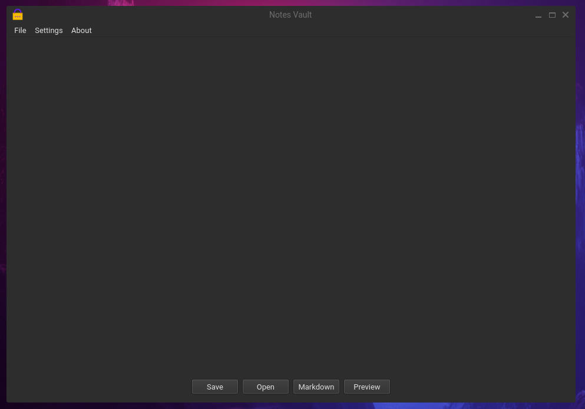
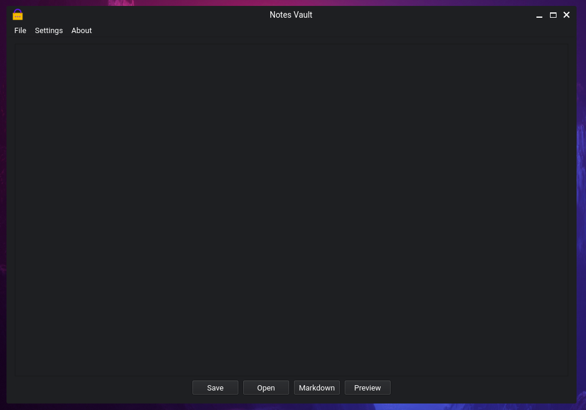

# NotesVault

## V4.1.1

## Overview

NotesVault is a secure notes application that allows you to create, save, and load encrypted notes. The application has evolved in this version to advance and simplify the cryptographic implementations boosting the security and performance of your note handling.

NotesVault now uses PBKDF2 to derive a secure database encryption key directly from your chosen password. The password is important since it is essential for creating the encryption key. This key is used directly to encrypt and decrypt your notes, ensuring maximum security.

These measures, along with the absence of a direct hash of the password, contribute to the overall security of the NotesVault application. Therefore, even if an attacker gains access to the encrypted files (note.enc or key.enc), they won't be able to easily derive the encryption keys without the **correct password**.

## Changes in the Security Operations:

1. NotesVault was initially creating a master key on the basis of the user's password and then using it to encrypt the database encryption key, which was being used for further processes to encrypt and decrypt the notes.

   Now, the application directly generates a secure database encryption key using the user's password, thereby eliminating the creation and usage of the master key. This change simplifies the encryption and decryption process and reduces unnecessary computation.

2. With this change in the key generation process, the codebase is more simplified and readable. The unnecessary encryption/decryption steps have been removed from multiple functions, making the codebase less complex.

3. Further code consistency has been maintained, many functions have been updated to be consistent with the new key generation implementation. This ensures a seamless and smooth operation of saving and loading notes.

4. Improved error handling across the application has been carried out to ensure broad coverage of potential exceptions. This will provide feedback to the user, thereby offering a secured and reliable NotesVault experience.

In case of any queries or suggestions, feel free to open up an issue.

## License

This project is licensed under the MIT License - see the [LICENSE](LICENSE) file for details.